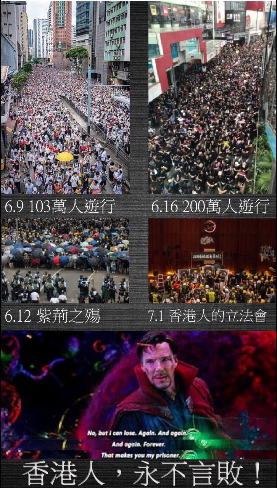
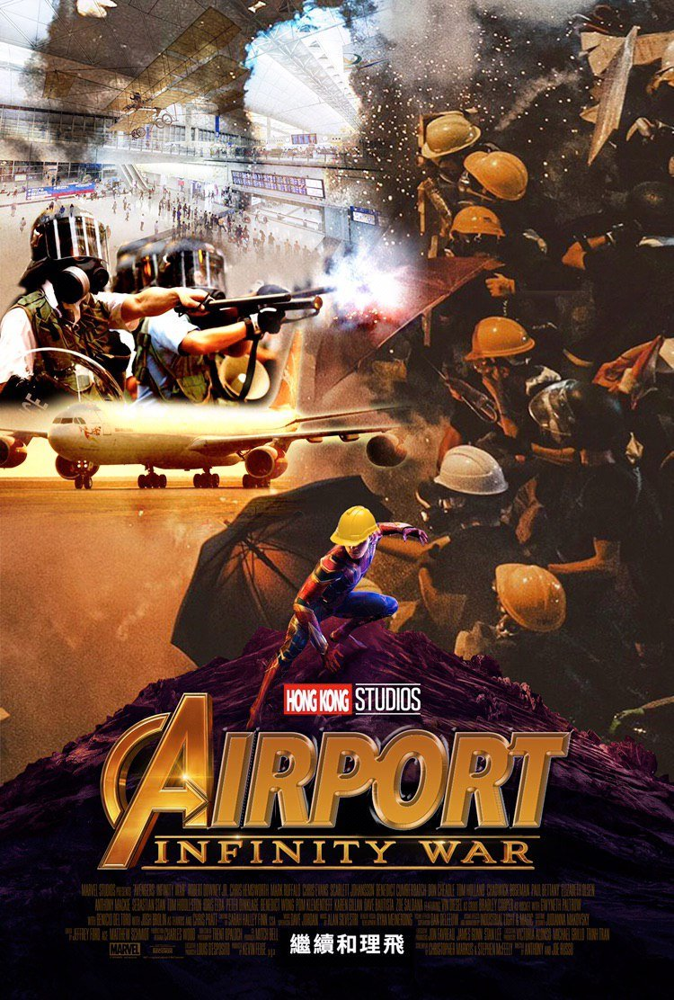
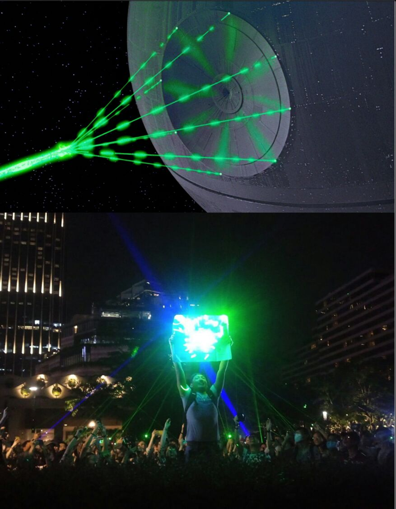

## Myth and myth-making in HK protest art: a thread 

*(Sep 21, 2019)*

HKers have been fighting for 3 mths, and we've seen how powerful modern myths can be. They frame our battles,  help us we see ourselves as a ppl, but also, they sometimes freeze solid a mvmt that's supposed to 'be water'. 1/25

One modern myth we've gone to again and again is the Avengers. They appear here as a bit of a joke early on in mid June, after the govt unleashed tear gas because there were 'rioters'. We joked those few rioters must be superhuman to warrant such overreaction. 😂 2/25

It then gets grim. These are from July - the 1st alludes to how Dr Strange 'beats' Dormammu by losing again and again. 2nd is from Endgame - the chance of winning is infinitesimal, and if we lose... So we have to win, whatever it takes. 3/25

By Aug, HKers have *become* the Avengers, because no one was coming to our aid. We're heroes assembling to take on a titan. But sense of dread pervades - note that ref to Ragnorak. Thor comes to that conclusion after deciding he had to burn down his home to save the world. 4/25

September, Avengers still here, especially Cap. His shield defends our frontline fighters. His words too. We've not given up, even after seeing our friends fail and fall 5 years ago. And we're here to fight. (That's a deep cut, whoever made that ‘permission' poster). 5/25

We tapped into Star Wars later. Started as a fun bit of trolling - in early Aug, HKPF arrested a student for buying laser pens, saying they're offensive weapons. 😂 From then on, laser pens (and occasionally toy lightsabers) became very much part of the protest and the art. 6/25

The HK version of Tom Jung's iconic Star Wars poster. We are a new hope. China is the Death Star, the police is its enforcer, Vader, and we have tear gas canisters flying instead of X-wings. Note R2 has been unceremoniously replaced by a bin. I don’t know why either. 😂 7/25

[t1-p16]
[t1-p17]

Let’s talk Luke. That’s his lightsaber on here (because me = nerd). Not just his, actually. Anakin’s first, then Luke, then passed on to Rey 30 yrs later.  We HKers are just the latest custodians of hope, part of a fight that started long before we were born. 8/25

[t1-p18]

Fitting the other SW story we see ourselves in is TLJ. We are a desperate Resistance. We are Rose, saving what we love, even as we grieve. We are Luke, facing the might of the FO alone, asking our family to choose better,  buying time for our friends. We are the spark... 9/25

[t1-p19]

These may just be kids referencing what they know. But these modern shared myths have also helped HKers frame what we're going thru, because... it still feels surreal. But heroes standing up against evil? - a tale as old as time, we can wrap our heads around that. 10/25

(Also, I know the likes of @Russo_Brothers and @rianjohnson can't, won't, and probably shouldn't engage in a thread on HK protest art. But still want them to know their stories have left their mark, and inspired a people.) 11/25

Apart from identifying with modern myths, HKers have also been active creating their own. The most prevalent is the distinction between the frontline 'braves', and the peaceful 'woleifei'. 12/25

[t1-p20]
[t1-p21]

The 'braves' have the most stunning art and posters. Because, I mean... just look at that imagery. We turn street signs into shields. We use mom's oven mitts to pick up tear gas canisters. We have our tennis rackets and umbrellas, in a city of fire and smoke. 13/25

[t1-p22]
[t1-p23]
[t1-p24]
[t1-p25]

More posters of the 'braves'  in HK. A crew of masked and geared up young people, posed like reluctant heroes in some cyberpunk world. And always, the damn tear gas. 14/25

[t1-p26]
[t1-p27]
[t1-p28]
[t1-p29]

There aren't many striking posters of the 'woleifei', because, as the myth goes, only the 'braves' do the striking. The closest we got are these, all of which are on the theme of the unity between the frontline and their more peaceful and rational brothers and sisters. 15/25

[t1-p30]
[t1-p31]
[t1-p32]
[t1-p33]

The idea of distinct roles - think RPGs where you've tanks, DPS and healers - makes for a nice, powerful myth and helped when we were first organising. The braves defend us! The woleifeis support us! But they at times also restrict us from seeing the reality. 16/25

[t1-p34]

The reality that the 'frontline' of resistance has changed. Students who join human chains. Housewives who shout out slogans at night. 'Gaifong's who protect kids and their neighborhoods form the HKPF. Musicians playing our anthem in a mall. They are all actively fighting. 17/25

[t1-p35]
[t1-p36]
[t1-p37]
[t1-p38]

The reality that the our 'braves' are not invulnerable superhumans. They get tired. They get depressed. They are not some anonymous 'black bloc' with no personality. They are just ordinary humans, faced with extraordinary circumstances. They can be us. They are us. 18/25

[t1-p39]
[t1-p40]

'Braves' or 'woleifei's isn't so important anymore - HKPF arrests everyone anyway. Line btw 'protestor' and HK citizen also artificial by now- when singing a song, posting on FB, jogging at night can be considered offensive acts, daily life becomes an act of resistance. 19/25

[t1-p40]

We have to let go of some of the myths we've built around ourselves and our movement. 'Braves'/'woleifei' distinction makes it easy for others to portray this as a movement driven by a few 'radical protestors', when in fact it's HK citizens resisting. 20/25

[t1-p41]

We must let go of seeing those geared up as invincible protectors of our city. Not because we're ungrateful - so many of them have bled and cried for HK during this summer of smoke. 21/25

But that's it. The 'black bloc' shouldn't be our solution to this political crisis. This should never have been their burden to bear. Even the strongest umbrella can break. We must understand this, sympathise, see the human under the mask, and not glorify their hell.  22/25

One last myth we have to let go of - that we're fighting against some unchangeable entity that has always been there, and will always be there, with meticulous plans stretching to infinity. Our city has existed as a colony longer than the giant has existed as a country. 23/25

China as the country we know now has only really come into being in the last 3 decades. Even during the last 10 years, there were rare periods of greater freedom. Even in the last 3 months, those we thought unbendable conceded something. Not enough, obviously, but... 24/25

... it means big 時代 changes are not impossible, that our 革命 may not be futile. After all, the Avengers found their 1 in 14mln chance. Luke saved his father. We must have hope, if not for ourselves, then for our stories to inspire all those to come who fight tyranny.  25/25

[t1-p42]

## Update, Oct 6, 2019

UPDATE - Star Wars protest art: We've actually had a few more. "Darkness rises, and light to meet it" frames the HKPF as the dark side, HKers as the light, ready for a final showdown... or a platonic hand-touching session in a hut in front of a roaring fire 😬 (All from TG/ Insta)

[t1-p43]

I have NO IDEA what this is. Is that *actually* Jesus with a lightsaber, protecting the back of one of our HK frontliners? Or is it an Obi-Wan who's let his beard grow out a bit? Either way, the pic is cute, and suggests god/the Force is with us. (From https://bit.ly/2IsTkaK)

[t1-p44]

UPDATE - Avengers/superhero protest art: The antimask law's inspired some interesting pieces. This suggests it's akin to the Superhuman Registration Act which forces heroes to unmask. In which case, neither Iron Man nor Spidey shld look so dour but this is cool art, so shush! 🤓

[t1-p45]

Things are dire, but we've kept our sense of humor. The left says antimask law means Iron Man now needs to take off his mask if he flies into HK. On the right, Thor is a frontline 'brave', and Cap is one of the peaceful woleifeis (hehe) - they must work together to save HK.

[t1-p46]
[t1-p47]

## Update, Nov 22, 2019

UPDATE: The Avengers, earth's mightiest heroes, will beat Thanos with... the power of the vote? 

"Differentiate between good & evil - every vote counts!" - says poster, encouraging everyone to vote in the elections tomorrow.

PS. Is that Captain Hong Kong?

Source: TG

[t1-p48]

## Update, Nov 25, 2019

UPDATE: The district council elections are over, but we ain’t done avenging yet. And now, the frontline knows there are people on their left... and their right, and above... Whatever it takes.

Source: TG

[t1-p49]

##(Jan 20, 2020)

UPDATE: Are the Avengers in a union?  Probably not, but this is the first we've seen the union formation materials reference Endgame.

'When you're tired, look behind you - there are many who support you. Save HK, save yourself. Join a union, fight against power.'

Source: TG

[t1-p50]

## Update, May 15, 2020

UPDATE: 😍 Ooooh. Star Wars continue to inspire! This is quite a picture - a nod to our lasers/lightsabers, 'Be Water'/ Laamchau and HK's famous neon lights

Source: stayfuckingcool - IG via TG

[t1-p51]
