# Memes about HKPF - a #HongKong art (?) thread
*Oct 2, 2019*

Sometimes, we do it for the lolz.

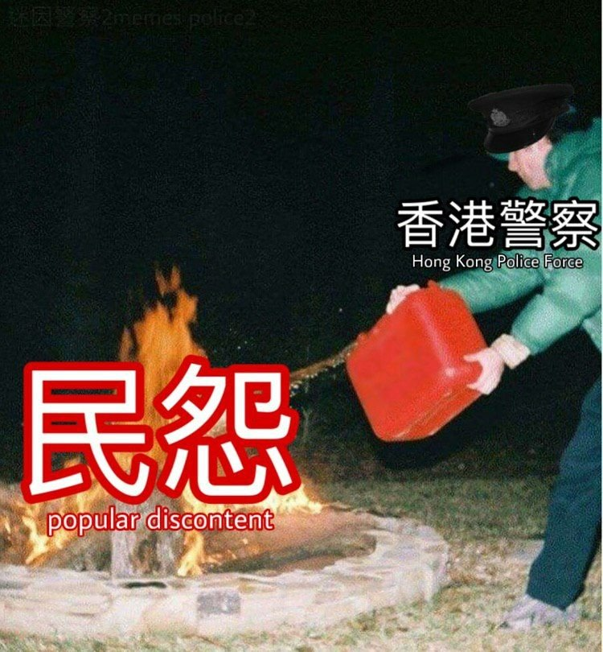

One of the recurring themes in the memes - and in real life! - is that the popo is just terrible at identifying weapons. Water bottles, laser pens, black balloons - they are now all offensive weapons. Oh wait, this isn't funny, it just means we're in a police state. Doh!

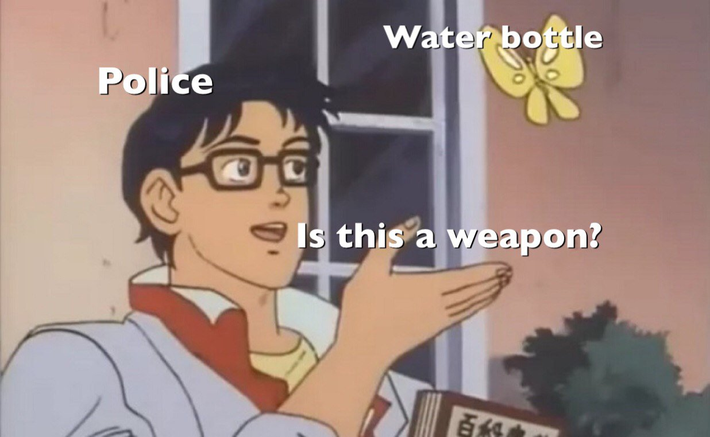
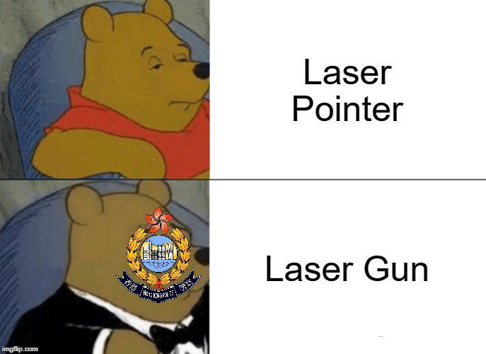

The other recurring theme in the memes - HKPF being absolutely useless pieces of poop. All of these collected here appeared shortly after Jul 21, when HKPF ignored emergency calls as triads beat the crap out of HKers in a metro station. Haha! Oh wait, this isn't funny either.

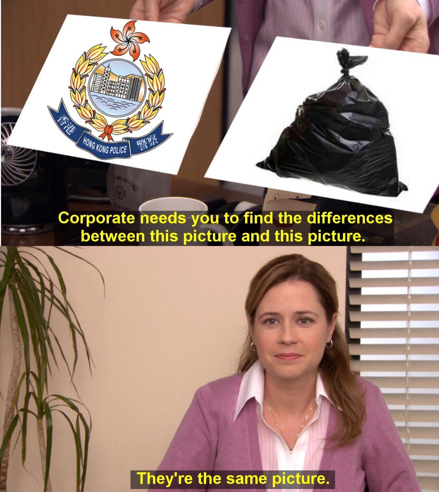

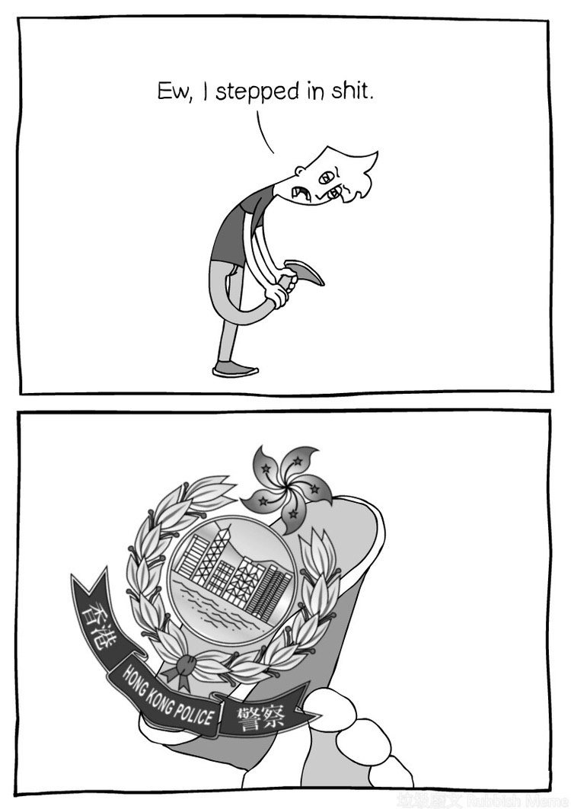

But we still try to make it funny! These are all about how the cops are the same as the triads, and sometimes they also go undercover (badly) and dress up as HK protesters and act as agent provocateurs. I'm totally on the floor laughing and crying. Oh, no, I'm just crying.

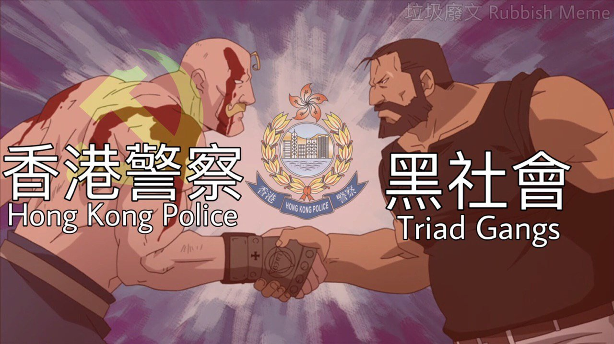
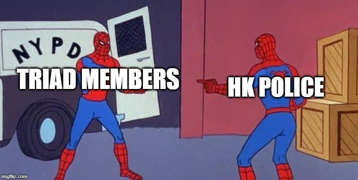
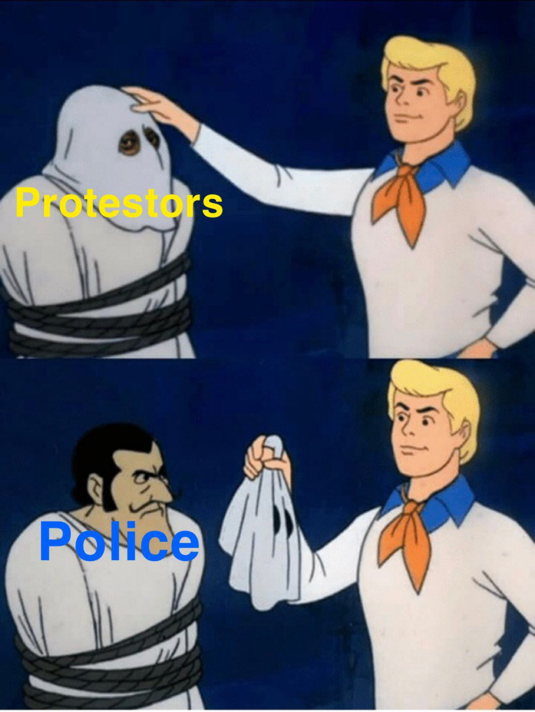

Wait, maybe I'm crying because of the teargas? Because we have memes for those too! It's obvious the HKPF are fans of Oprah: YOU get teargas, YOU get teargas, YOU get teargas! EVERYONE GETS TEARGAAAAAS!

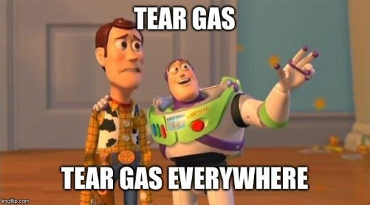

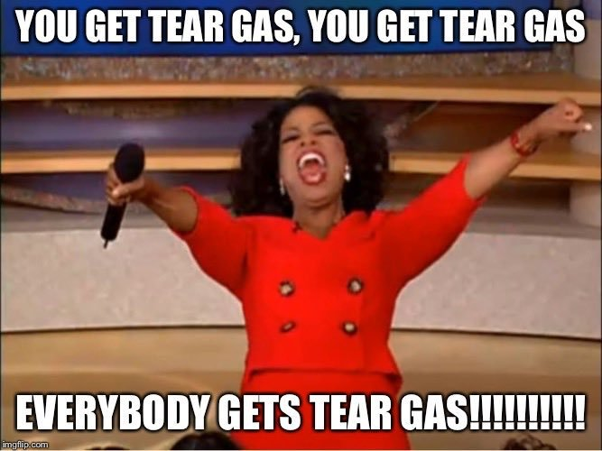

Ok, not everyone gets teargassed. Only the pro-democracy ppl. The Hokkien gangs & the pro-CCP ppl get police escort after beating HKers up, while HKers just get beat up... by the Hokkien gangs, the pro-CCP ppl, & the police. 

There's no punchline here, the police *is* the joke.

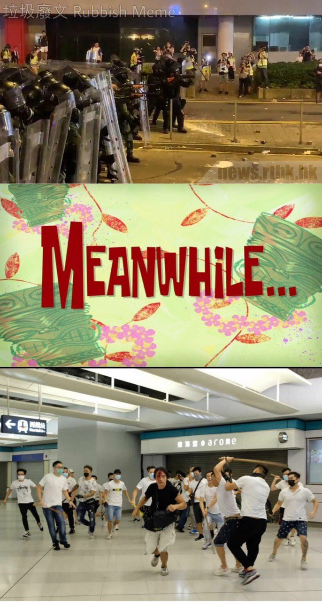
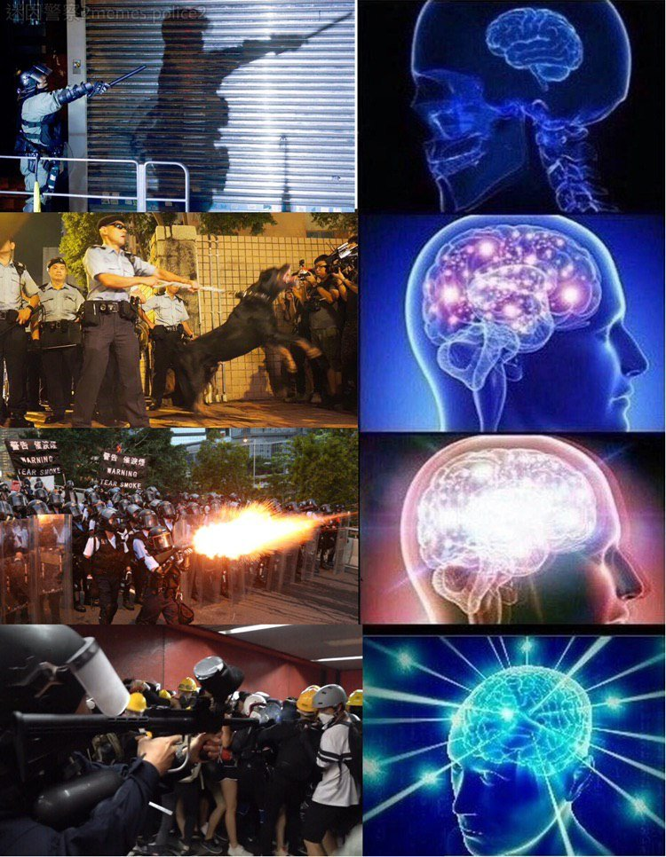

