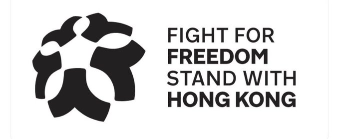
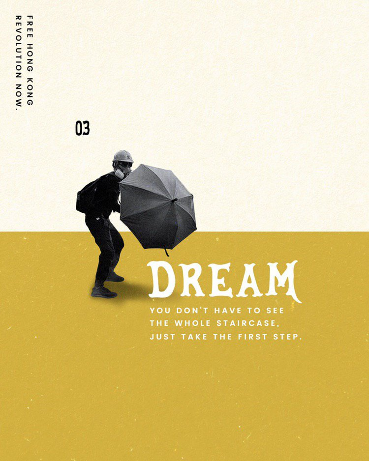
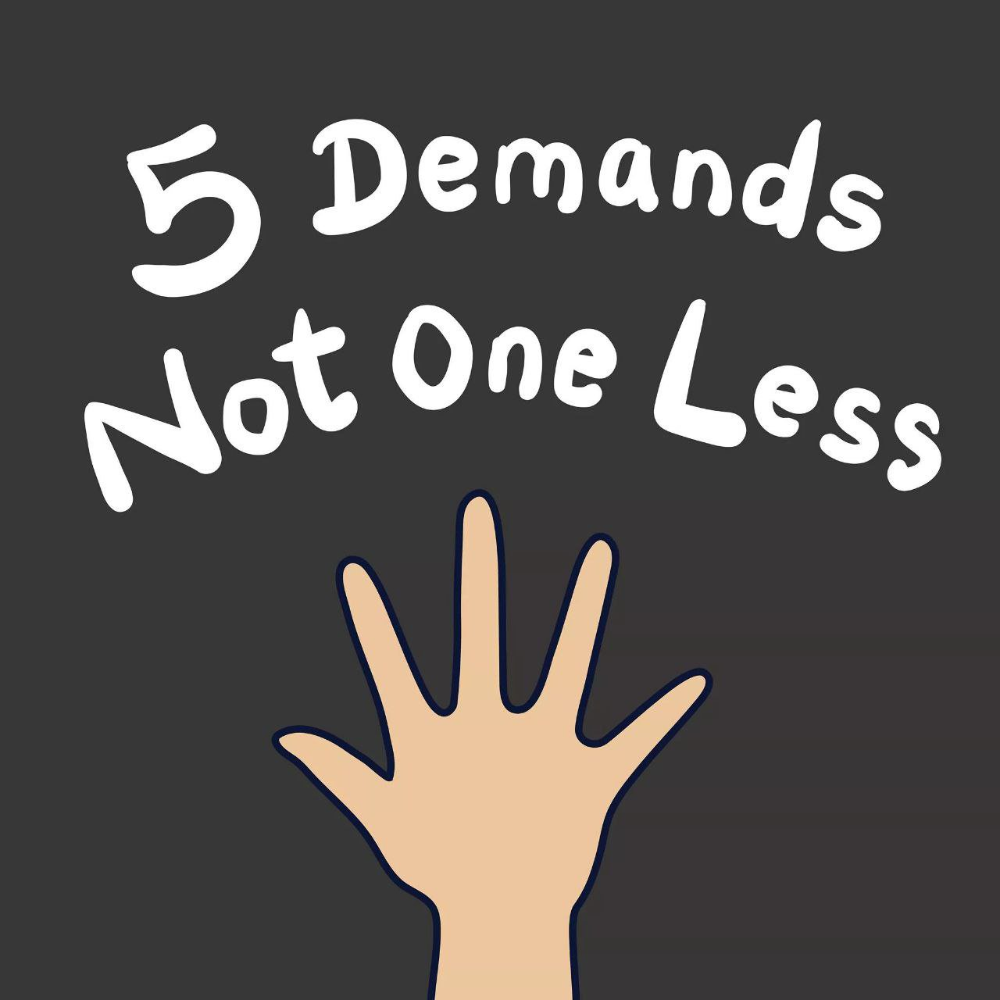

# Stand with HK
*Oct 6, 2019*

What's all the fuss about? This picture represents HKer's fight for democracy, told through the lovely logo.

It's made of 5 '人' (people), suggesting solidarity.

They also look like ☂, one of the classic icons of the movement & the Umbrella Movement 5 yrs ago.

There are 5 of them to represent each of our original '5 demands' (list has grown since then)
- complete withdrawal of ELAB
- independent inquiry into police brutality ...

- retraction of riot characterisation
- release of all arrested protesters
- authentic universal suffrage

We've seen it before in [my thread on the bauhinia](https://cwylo.github.io/hkprotestart/thread6). Flattened out like below, it looks like a morning glory, & harks back to our crowd-sourced anthem, #GloryToHongKong

But the globe shape for the logo is important. It shows all the people of the world, hand-in-hand, united. Because the fight for human rights, for dignity, for democracy is universal. 

Fight for freedom. #StandWithHongKong 

