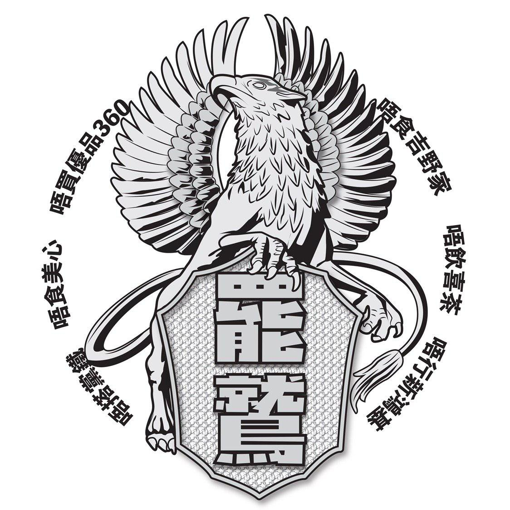
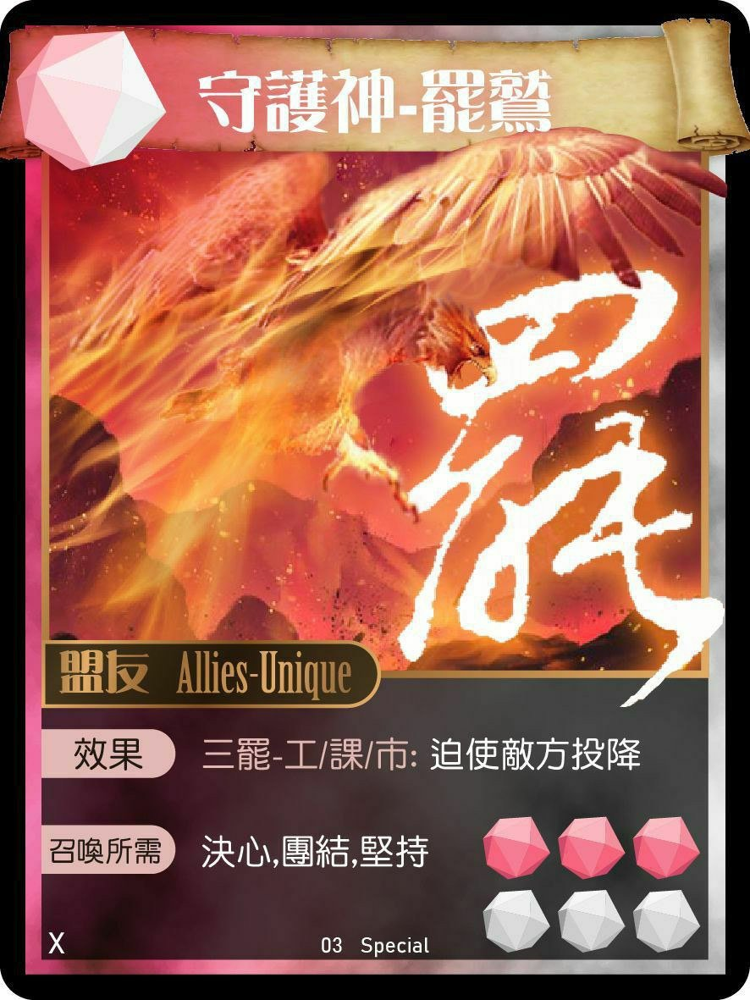
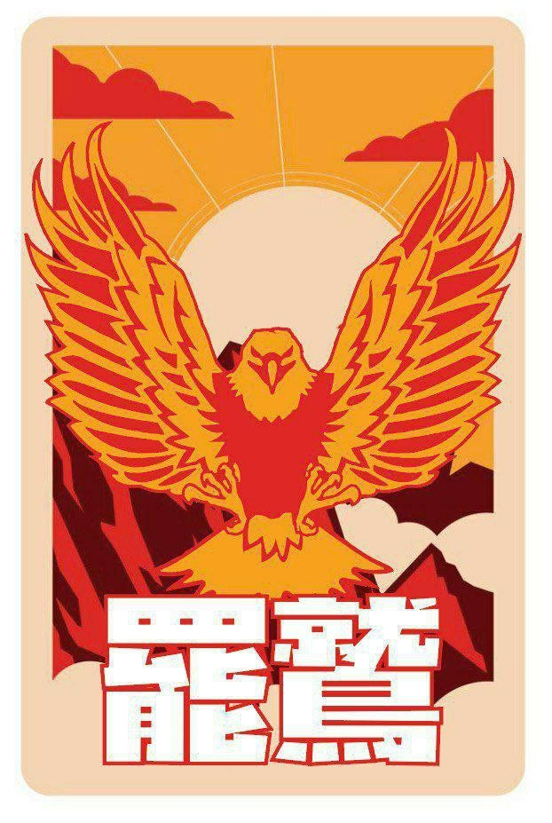
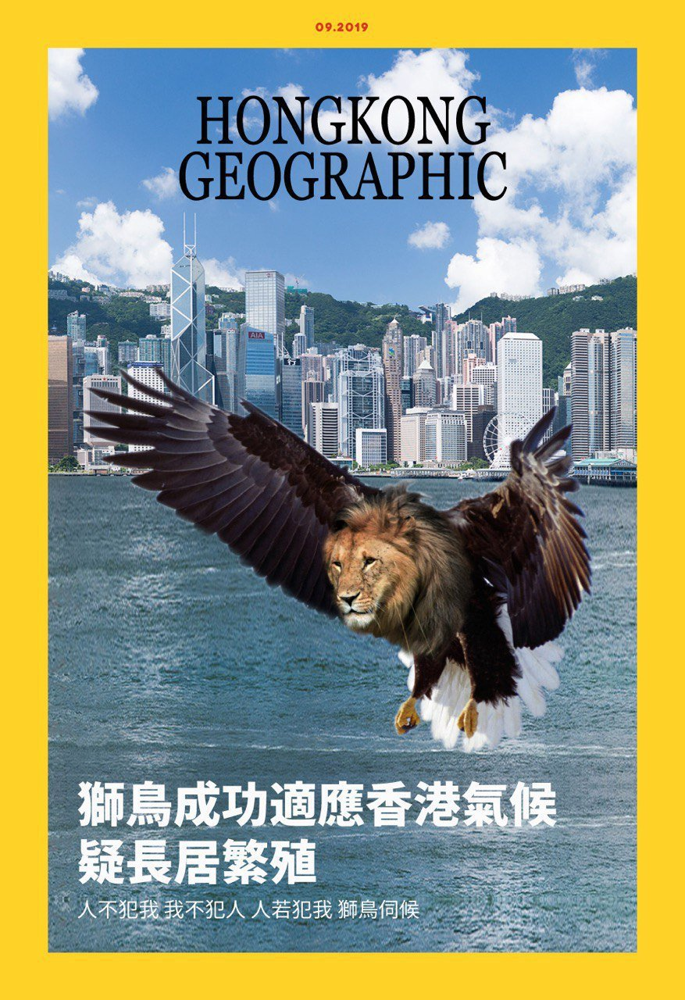
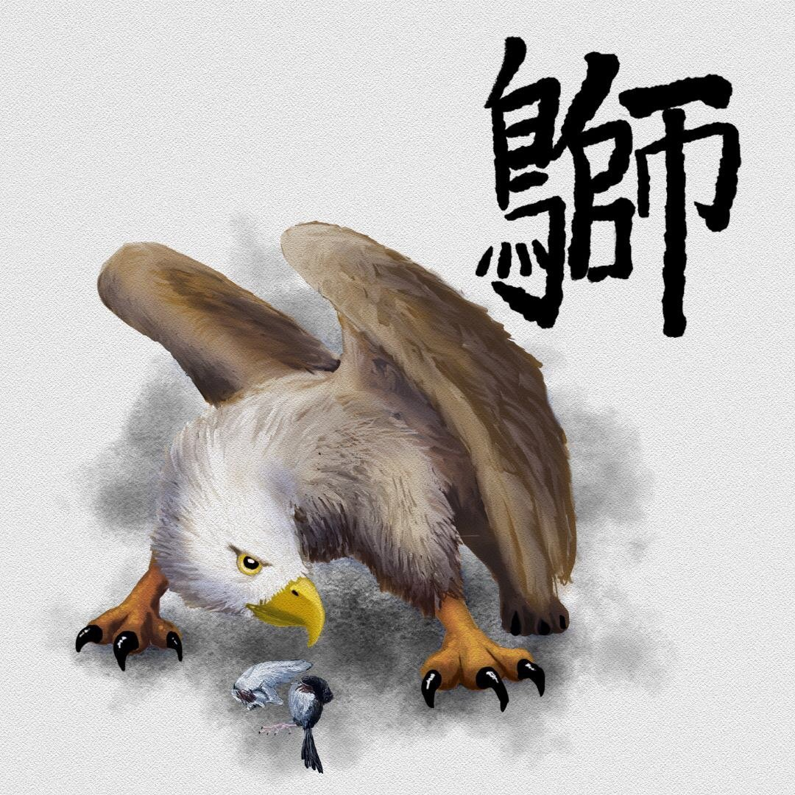
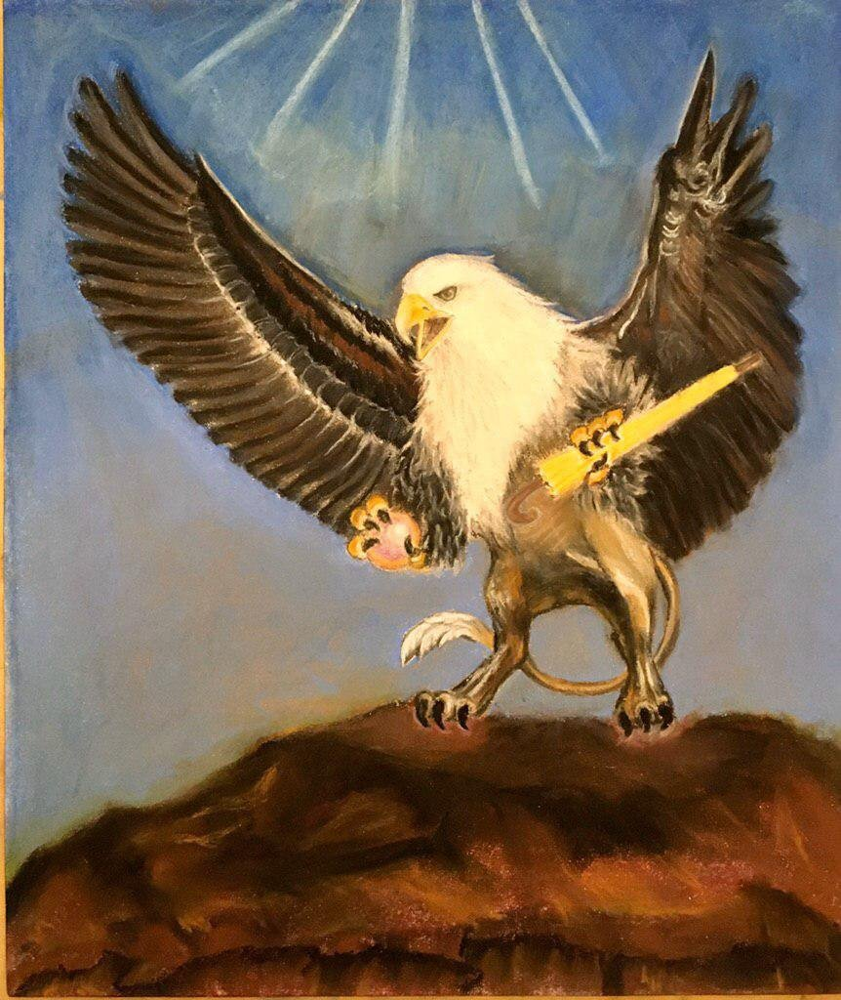
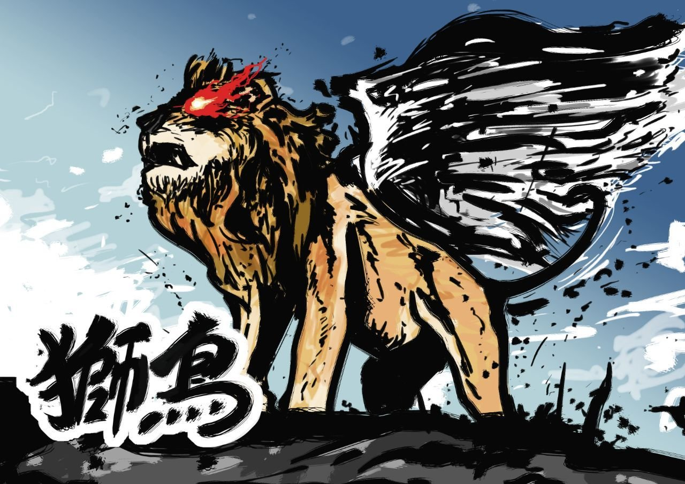

# Birdstrike
*Oct 10 2019*

Ok folks, so there's this new bird floating around in the art, a close cousin of the griffin that came before. The name as @aaronMCN describes below *can* mean forget it (and it does), but 罷 also refers to boycott or strike.

> With further protests possible at shopping malls this weekend, the griffin is used in the latest artwork. The expression 「罷就」, roughly matching the English phrase "forget it," has been modified into 「罷鷲」

> Sounds the same verbally, but the latter evokes the mythical animal

[(source)](https://twitter.com/aaronMCN/status/1182494355900092417)

The boycott/strike meaning of the bird's name is important, bcos it marks a slight shift in tactic/strategy. This new icon sure looks epic and grand, but its main attack as the art suggests, is rallying HKers for peaceful actions. We fight w/our wallets, we fight w/ our strikes.

Contrast this to the original griffin, whose name is a wordmash of 獅(lion) & 鳥(bird), as it sounds like 私了 (to resolve an issue privately) in Canto. It's the icon for vigilantism, which some hv resorted to after seeing HKPF ignore crimes committed agnst pro-democracy HKers.

Worth pting out the 'striking bird' looks no less fierce than the 'lion bird' - both are protectors of HK. The layers of word play with the 'striking bird's name also notable - the mvmt's saying, let's forget abt the morally grey acts for now, and try sth different.
