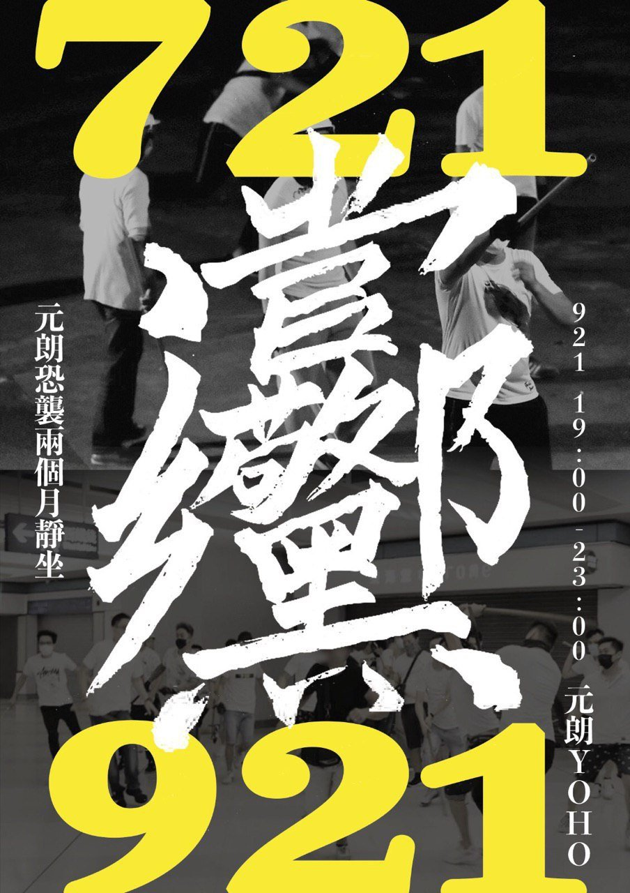
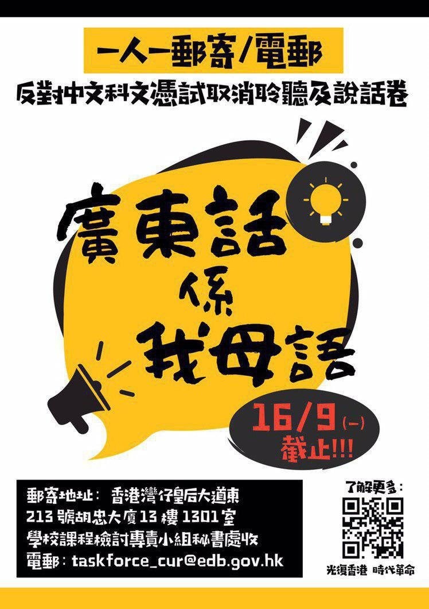
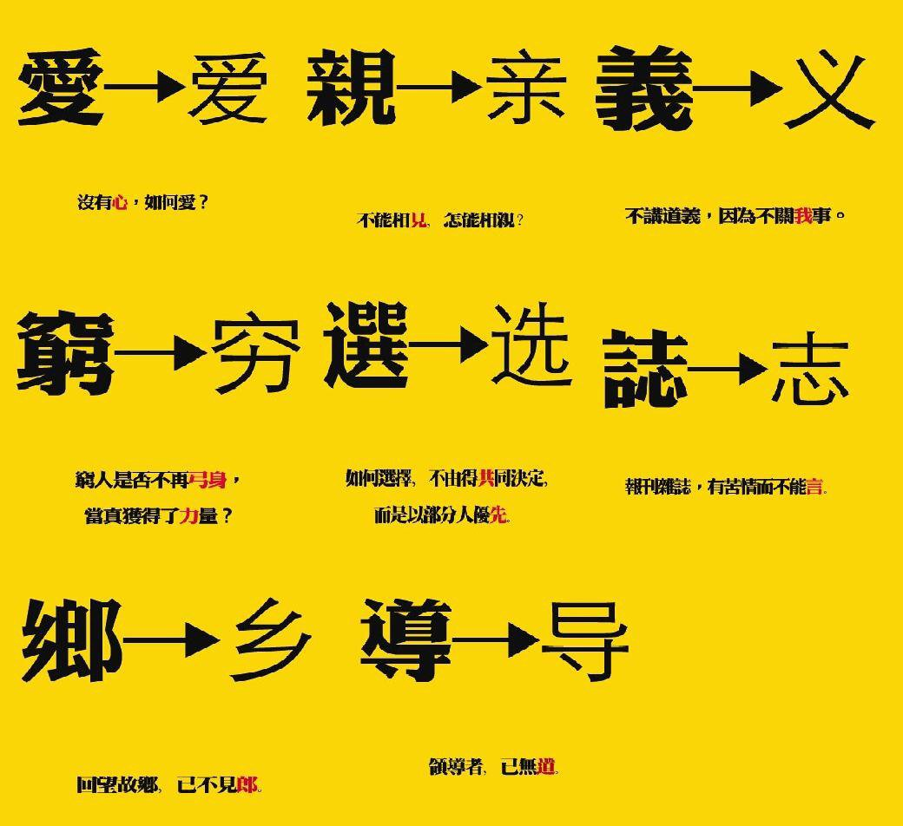
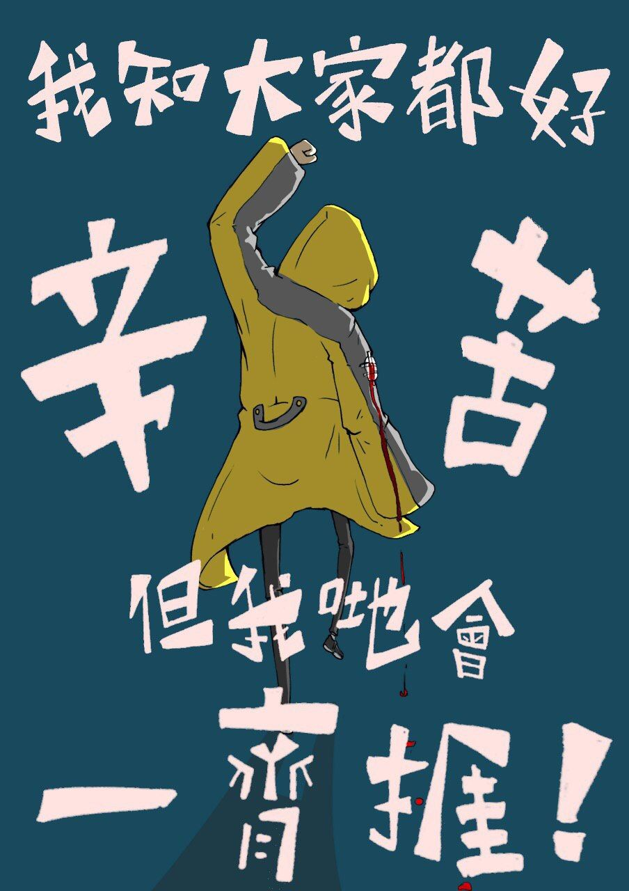
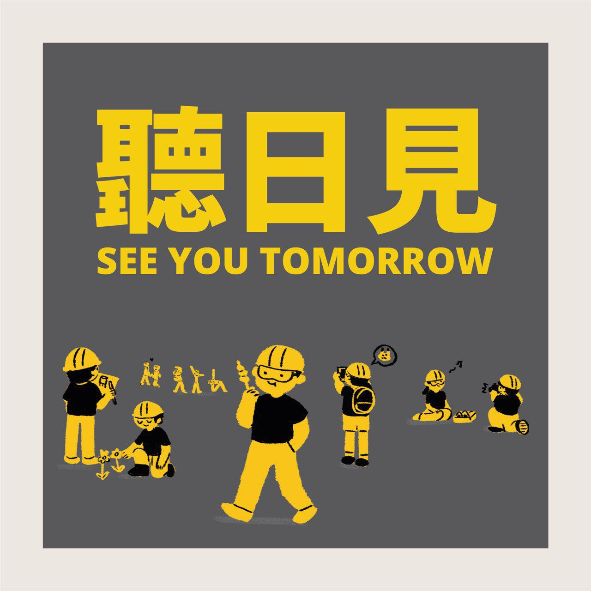
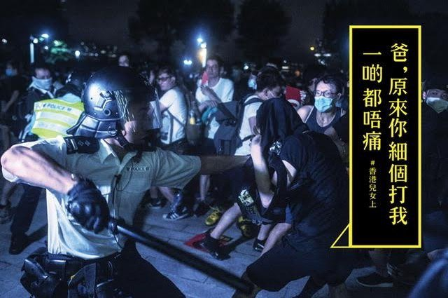
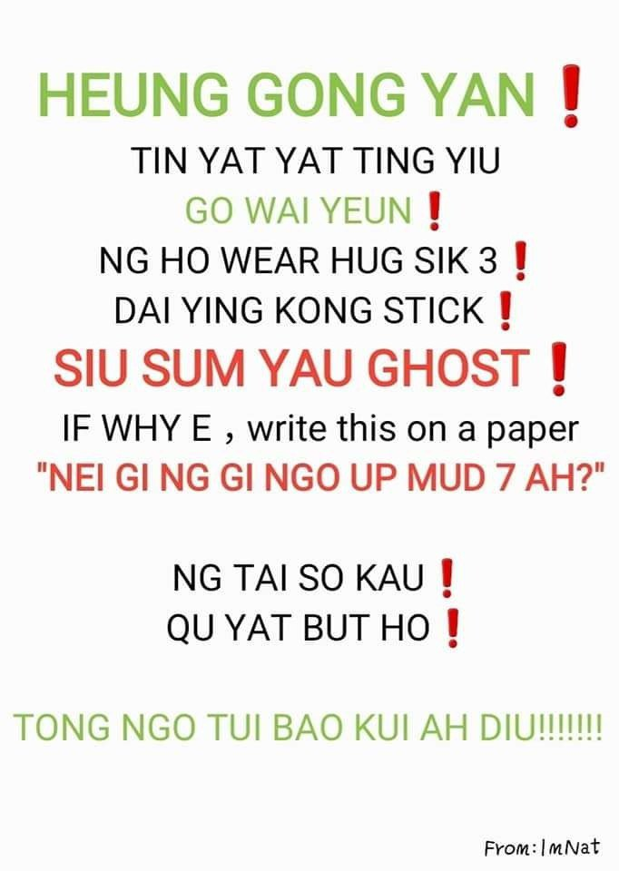

# The Weight of Words
*Oct 12 2019*

Language has become another frontline of HKers' resistance. Canto and trad. Ch. are used almost exclusively in our art, & increasingly complex new words are created to describe increasingly complex political realities.

Primer for those abroad. HKers *speak* Cantonese, distinct from Mandarin, lingua franca w/in China. HKers *write* in trad. Ch., while mainlanders use simplified Ch. What's written in trad. Ch. is seldom verbatim what we speak - lexicon & grammar differs... it's complicated. 

But HKers hv embraced our complicated language & weaponised it as a protest tool. Following the☂Mvmt, majority of current mvmt's art are written in trad. Ch. &/or written in verbatim Cantonese. It is our way of proudly announcing we hv a distinct voice, a distinct identity.

We took it to some extremes. An effort to confound mainland 'spies' was to use Kongish, spelling out Canto words in Eng & throw in some Eng words for giggles. Problem: Canto has 9 tones - 'si' can take on at least 9 meanings. It indeed confounded & the effort lasted <48hrs 🤣 [^1]

[^1]: While Cantonese has two romanization systems, neither are commonly taught in Hong Kong schools.