#Drakeposting
a (ridiculous & short) #HongKong protest art thread

*Oct 14 2019*

HKers make ‘serious' art with words & refs to canon. And then, sometimes, we just make memes. The truth is, memes are as much a common language to a gen. of HKers as Canto or classical art. So... here's Drake!

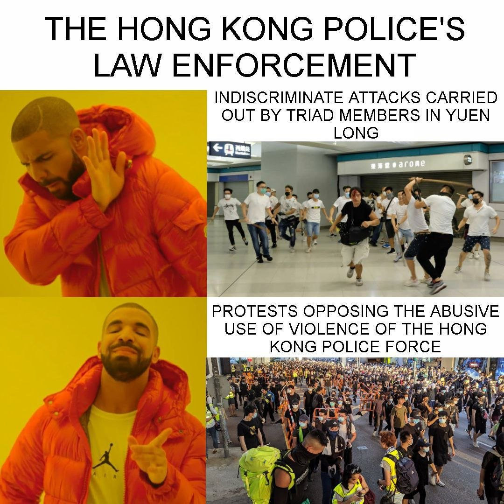

Drake was there from the get-go. This was him in mid-June. Joke here is HKers *theoretically* can freely assemble for religious worship w/out approval, so we sometimes gather for 'prayer mtgs'. 'Sing Hallelujah to the Lord' is part of the HK mvmt's repertoire for this reason.

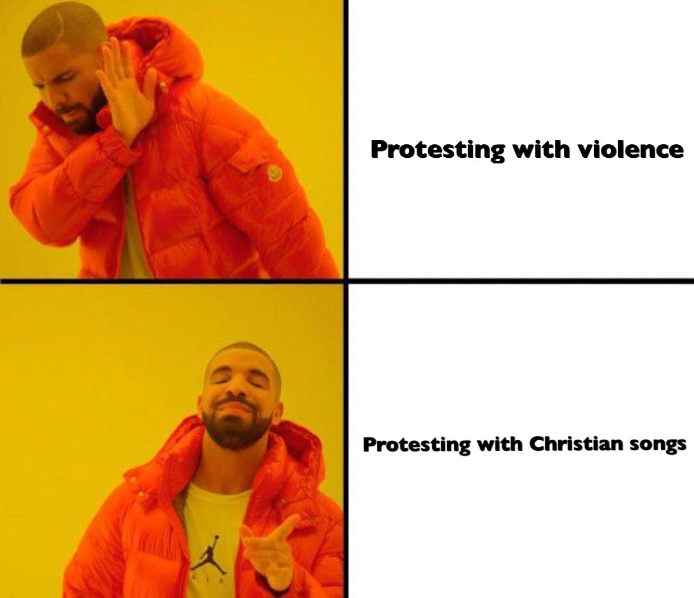

These touch on the incident of when thugs stormed metro stn to assault HKers as HKPF looked other way in Jul. Drake's poking fun of HKPF's selective law enforcem't - beating civilians up is fine; ppl assembling for protest isn't. We knew then it marked a breakdown of rule of law.

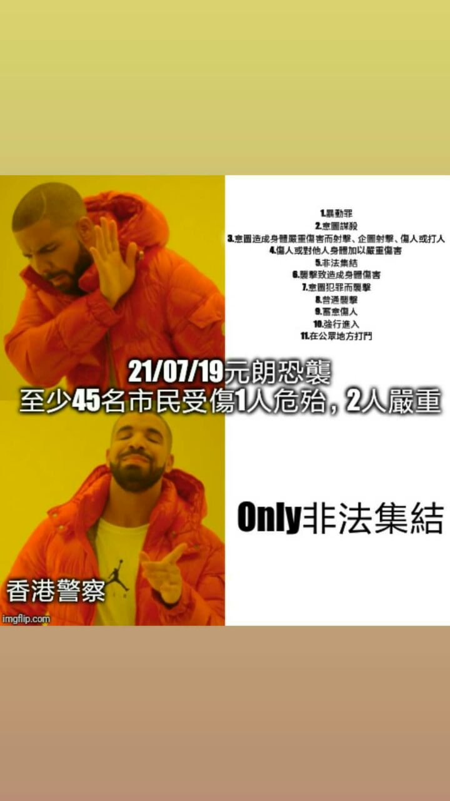
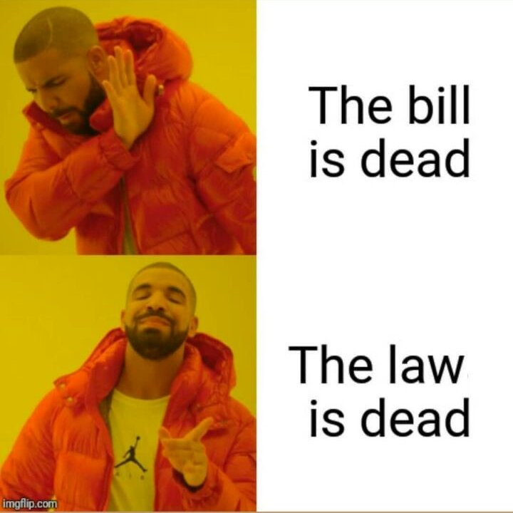

These are more recent from early Oct, concerning NBA and South Park. I think they are pretty self-explanatory (as memes should be!). See, even Drake says #BoycottBlizzard.

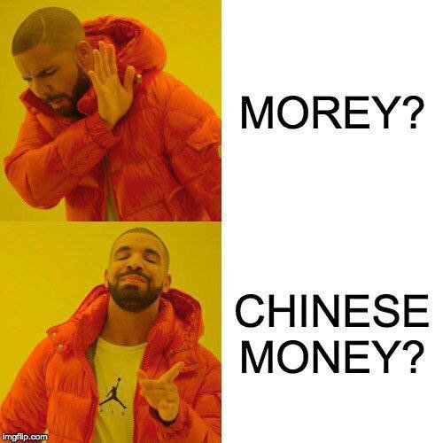
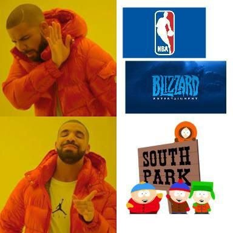

Popo/ Drake memes! We don't like the CCP-backed violence, but we can all get behind the brave soul who - seemingly for the whole city - asked the HKPF,  'where is your conscience?' (There's even a blank one for anyone out there dying to make some more HK protest memes.)

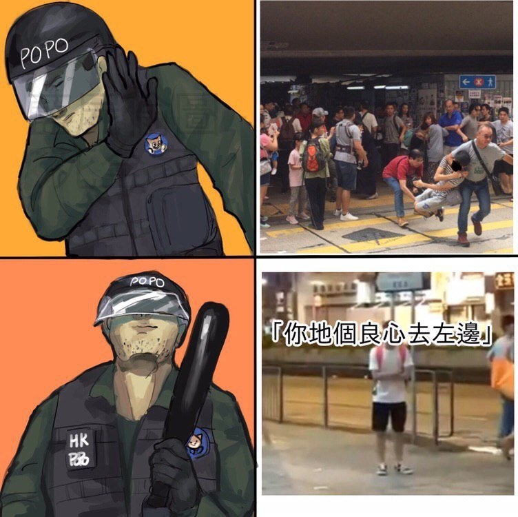
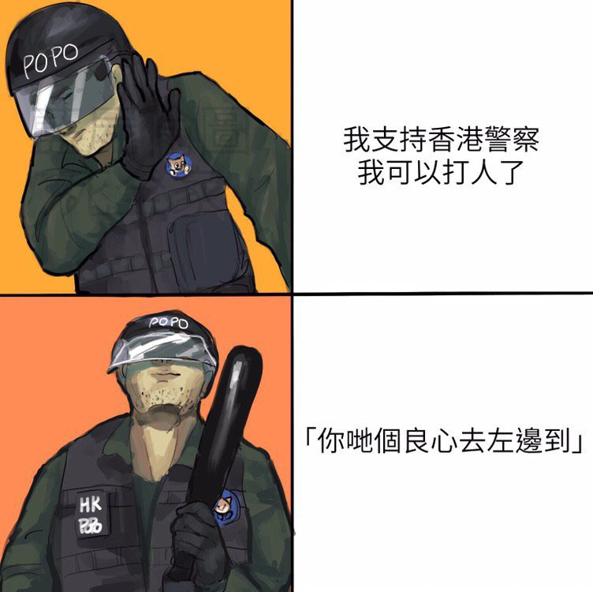
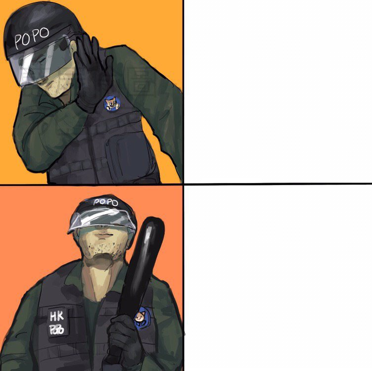

Lam appears in the Drake memes too. The 1st pts to how she embraces mainland apps like Weibo & TikTok. 2nd one sees her trying to prevent 'laam chau' ('if we burn, you burn w/ us!') by... pursuing the Emergency Regulat'ns Ordinance, which wld likely just hasten 'laam chau' more.

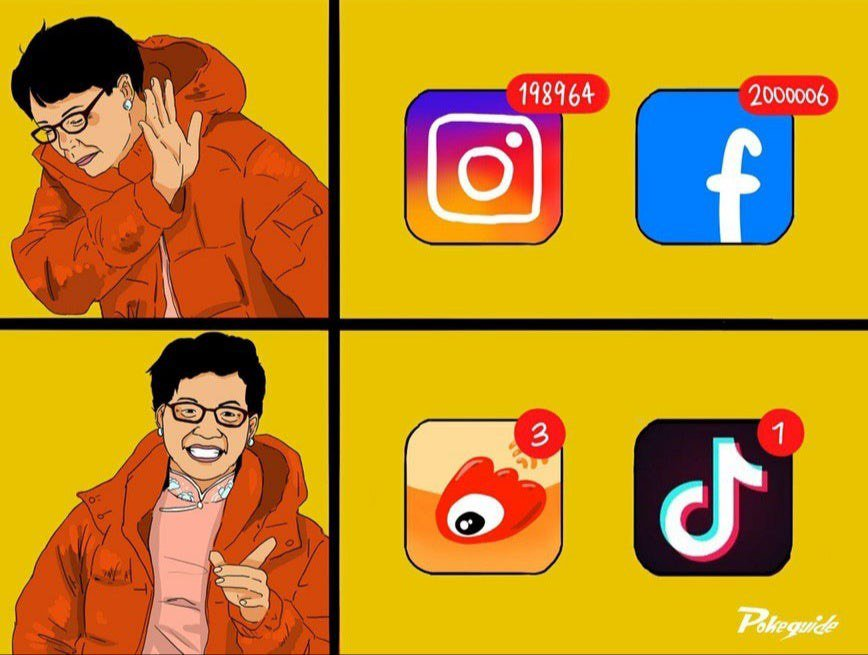
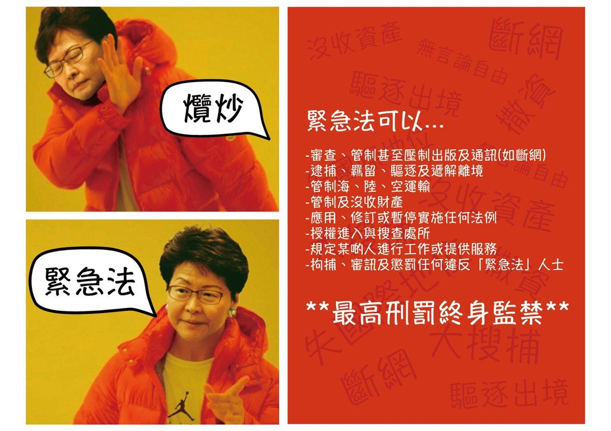

Pepe alert! Clarification for those abroad: the frog doesn't carry the same alt-right baggage as in West & he's just a symbol for hope & love in HK🤷‍♀️. One on left shows mvmt's moved on from 5 Demands to also asking for disbandment of the HKPF. Heady stuff. In a Pepe/Drake meme.

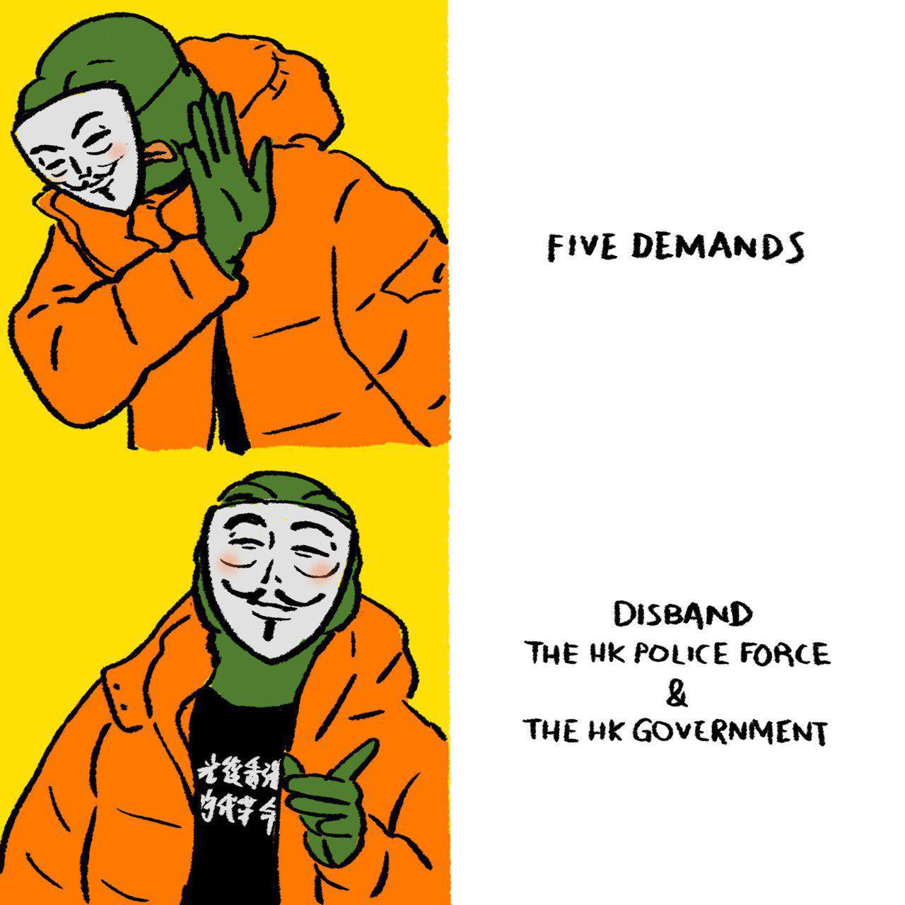
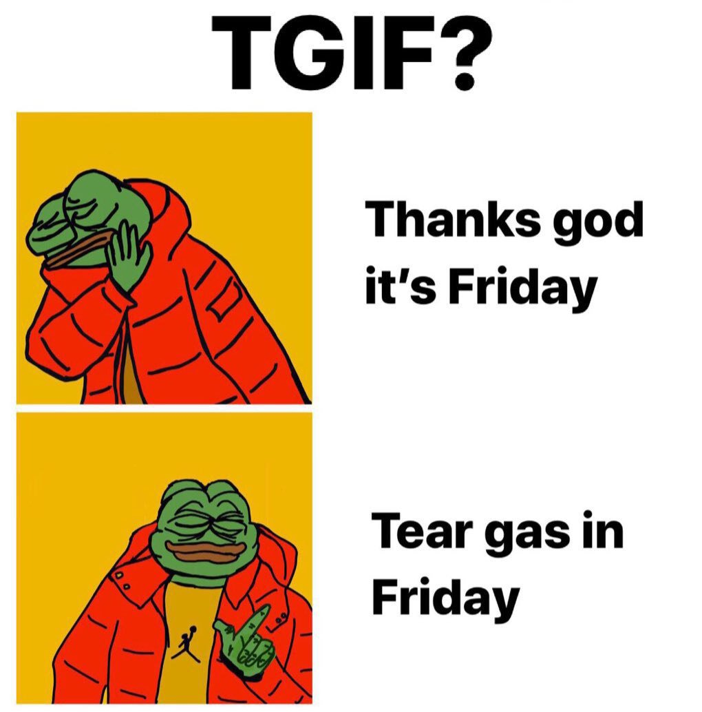

##Update, Jan 25 2020

UPDATE: Come on, we know Drake memes never stop. The one below from November is about boycotting pro-CCP, 'blue' shops, and supporting the #YellowEconomicCircle 😊

And these are about the #coronavirus outbreak. See thread below for fuller description 👇

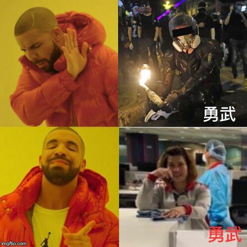
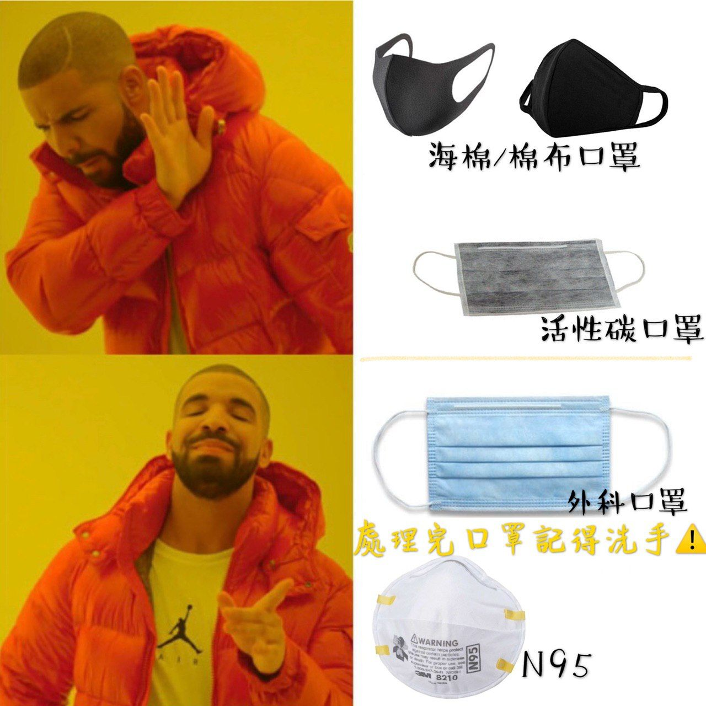

