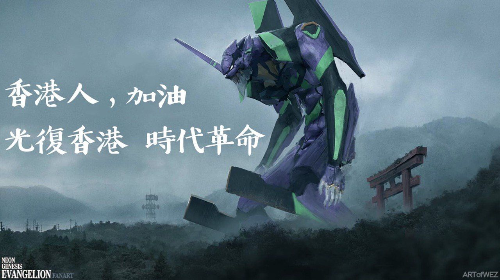
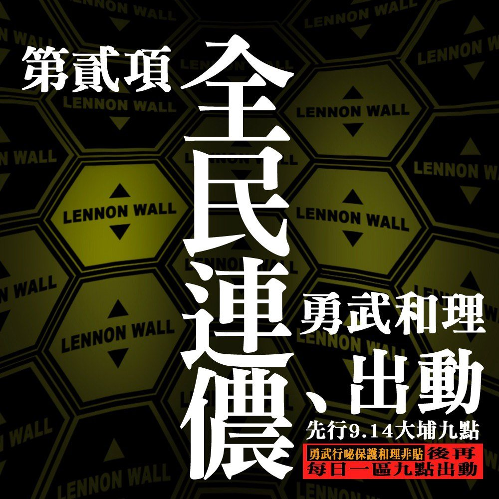
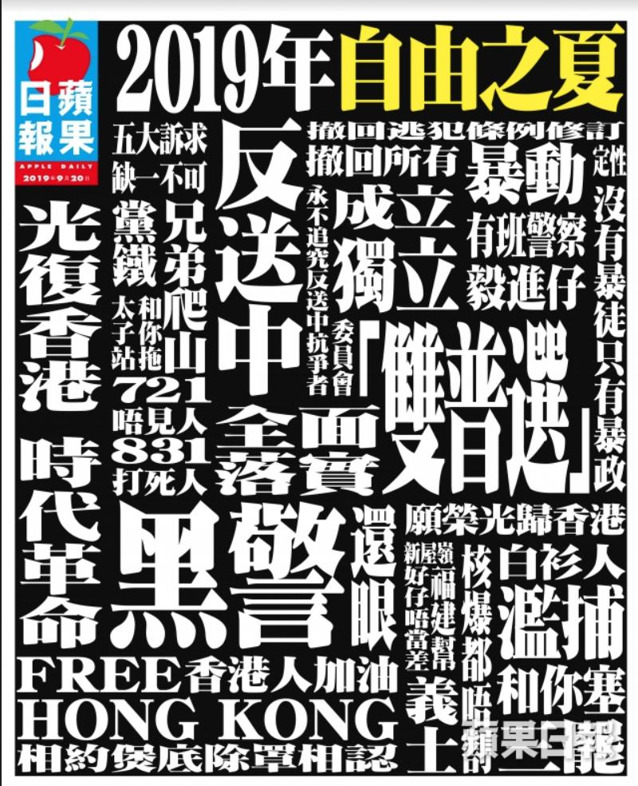
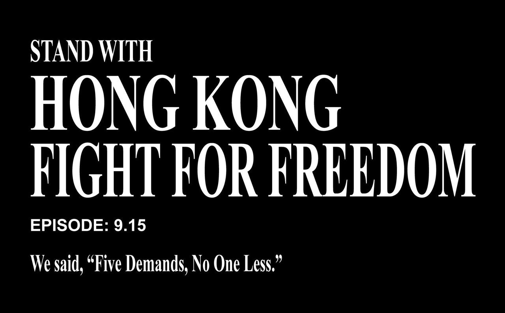
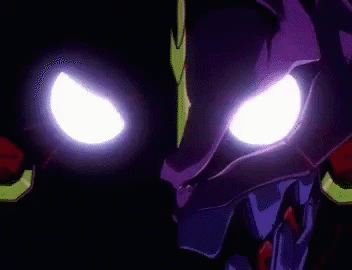
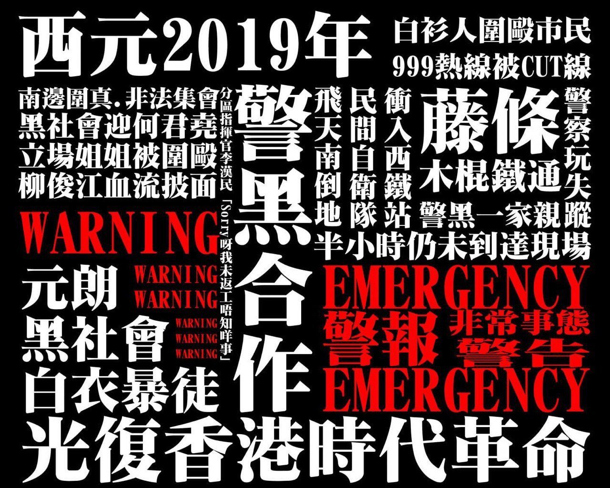
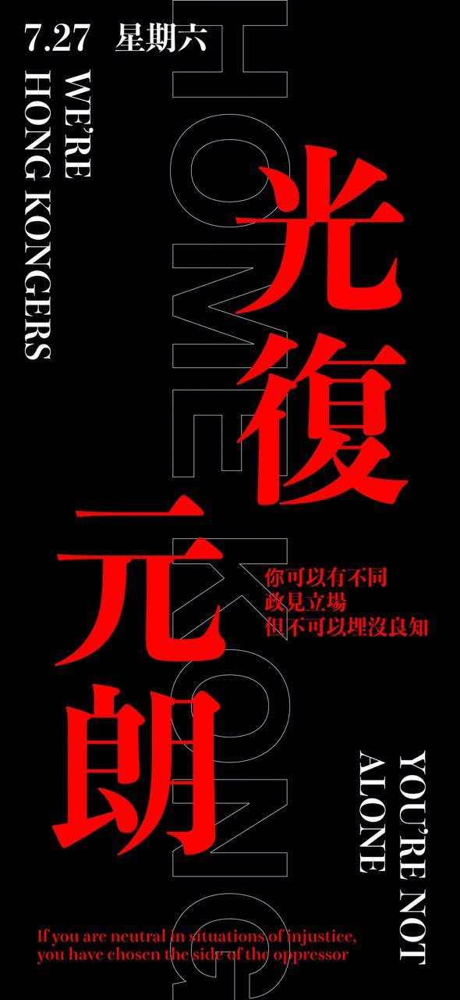
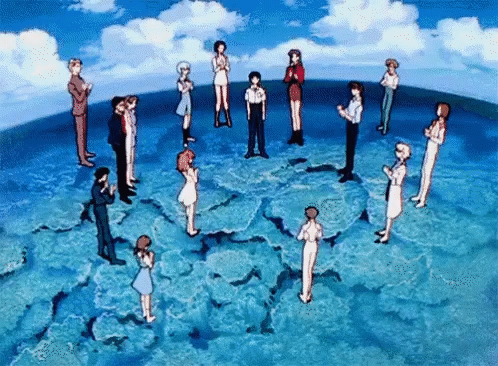
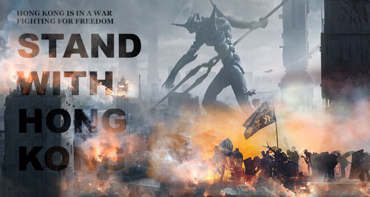

## Evangelion in #HongKong protest art: Warning - a (sad) thread

*Sep 23, 2019*

By now we all have rightfully dunked on the CCP-produced pile of cringe that took EVA aesthetics without  engaging with the content. It was, surprise!, trying to ape this vid that HKers put out nearly 2 weeks ago. 1/7

[https://twitter.com/KsteveT/status/1172648073173929985](https://twitter.com/KsteveT/status/1172648073173929985)

【9.15 Demonstration 港島大遊行】

Nothing can stop us, #5DemandsNot1Less 
站出來告訴政府你未收貨！

2019.9.15 1430 Causeway Bay銅鑼灣 --> Central中環
(FYI: #HKpolice is not issuing the notice of no objection for this demonstration 民陣上訴失敗，故警方維持不發不反對通知書）

Ed note: [this is the video in question.](https://twitter.com/rhokilpatrick/status/1176075324615839744) 

The EVA HK protest art is a weird lot because it's a bit incoherent. Understandable - NGE is tough to engage with. There's no good reason for why Unit 01 would say 'HKers add oil!'. Or why the 'publicity group' that makes protest art should be NERV. But it looks rad? 2/7

And because it looks rad, we see protest art - and Apple Daily! - take on the EVA aesthetic, and make these beauties. Well, "it's rad" is the tired take. The wired take is that EVA appeals to a certain demo - young and keen on mecha. Which, yeah, describes a lot of us 3/7

The inspired take is sadder. NGE is about children stripped of agency, forced to bear the sins of their fathers (and mothers) by fighting otherworldly creatures that rips them apart inside and out, so as to prevent a repeat of an apocalyptic event(...that escalated quickly!) 4/7

The painful history, the condescension of 'mother' Lam's 'they have no stake in society'... it's not hard to read the HK protest through the EVA prism. Especially since the Rebuild series suggest we're all just trapped in a never-ending cycle of violence and pain. 5/7

The inspired take is also hopeful? The original tv run ends with our main character regaining agency and choosing to live, despite the world round him going to pieces. You are not alone, we're told (also title of 1st Rebuild!). It's tough, but there's value in staying alive. 6/7

This message is important - lots of HKers are depressed. It's also vital for the mvmt - the last 3mths has shown us HK isn't a city that's dying, it's a city that wants to *live*. EVA aesthetic looks rad, sure, but with it, we're also crying out, affirming our will to be. 7/7

## Update, Nov 15, 2019

UPDATE: A pic of EVA 01 trying to protecting Tokyo 3, with that now famous picture of the Siege of CUHK superimposed on it. I guess it's trying to say we shouldn't let kids bear the burdens of our wars? That or the students are about to go berserk?... 🤷‍♀️🤷‍♀️🤷‍♀️

