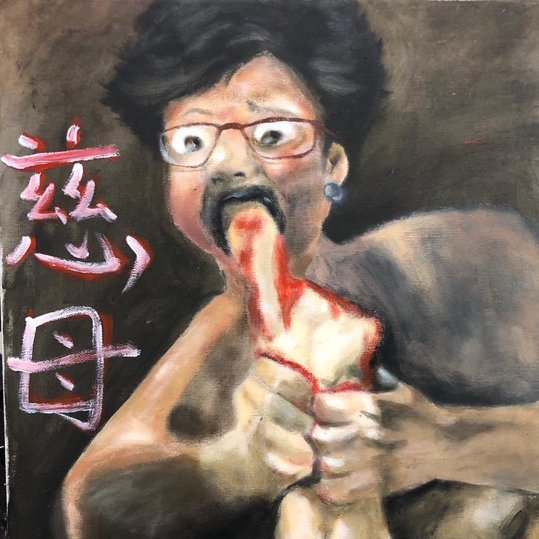
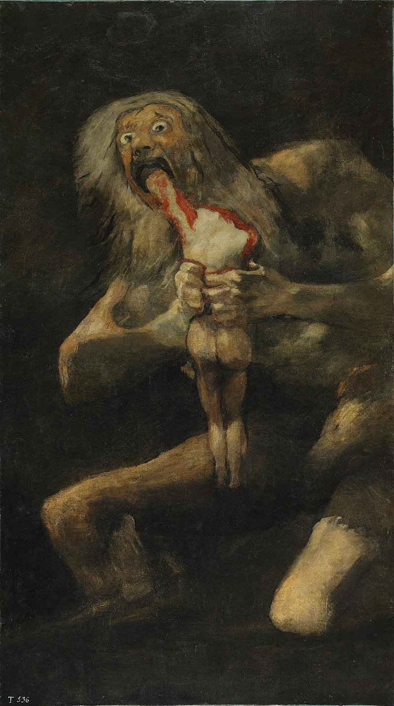
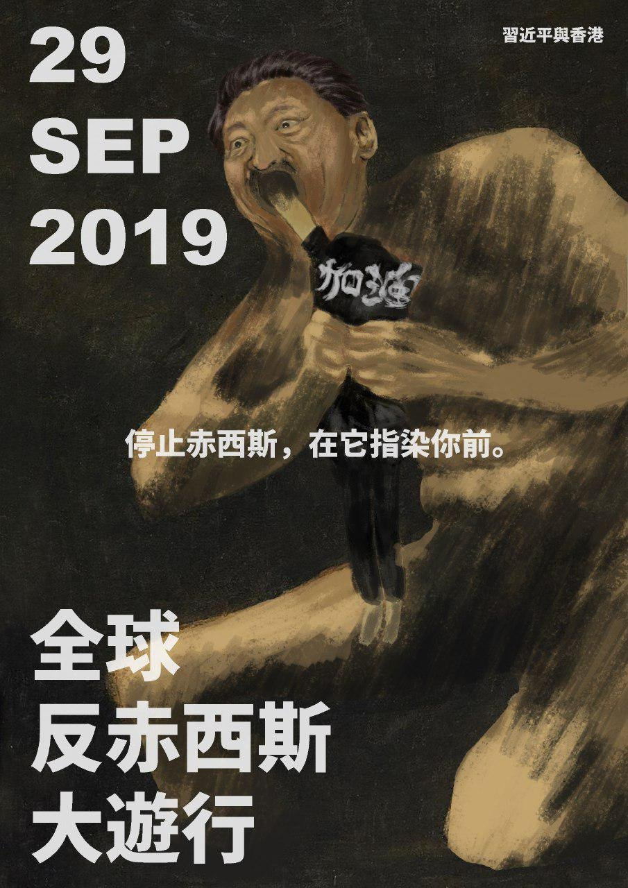
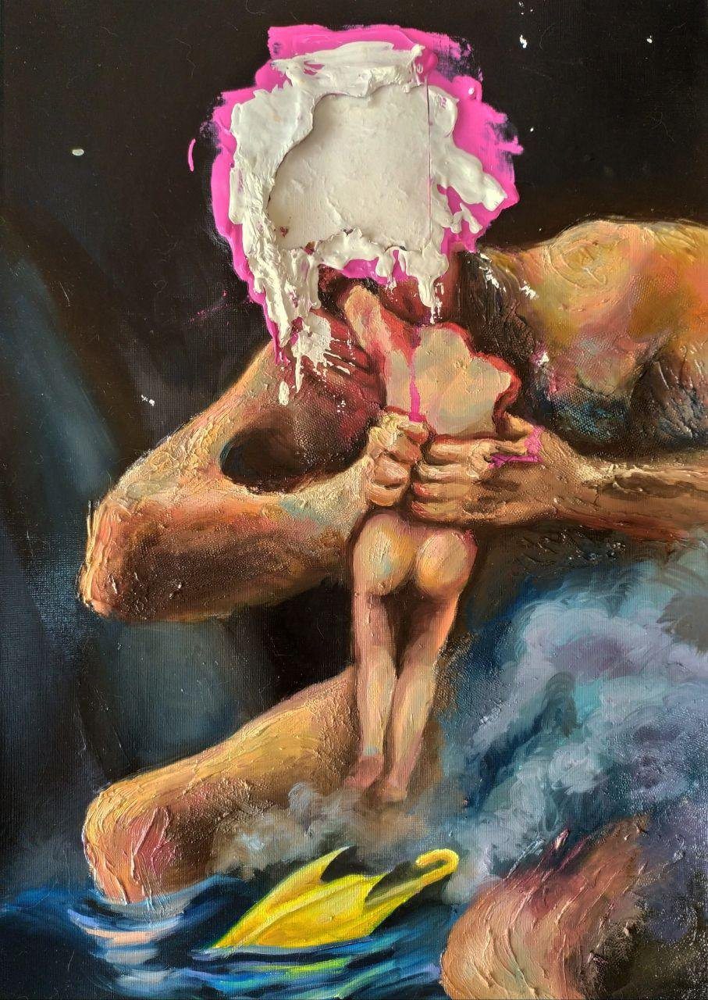

# Devoured by Time
*Oct 14 2019*

Goya’s Saturn Devouring His Son’ has been referenced a few times in the protest art, and highlights the tension between the regime's patrimonial condescension and HKers' awoken sense of self & independence.

This popped up late Sept & featured Xi as Cronus/Saturn, crushing bodies & shattering bones of HK. In Greek mythology, Cronus eats his children, fearing they wld overpower him one day, as he had his own father. Like Cronus, Xi is bathed in darkness, fitting of his dark deeds.

The next is from just after Oct 1. Lam replaces Xi & on left are the words 'loving mother'. Also new here, blood. After HKPF shot a young man point blank in the chest, HKers' emotions were raw - our art asks, how can a govt that's suppose to lead consume its own children?

This came thru TG today. In this homage, we see the common icons of the mvmt - umbrella & teargas. Cronus' visage has bn painted several times over, as if to say the violence consuming our youth is a faceless system, but no less monstrous than Lam or Xi. It devours us all.

It's all a bit gloomy. But let's finish the story of Cronus. He eats his children, but they fight back. Zeus, his youngest son, makes him disgorge his long-trapped siblings & together they overthrow Cronus to bring about a new age. Even Titans fall.

FYI, not the first time a Goya's been referenced in our HK protest art. See here for another homage-within-homage:

> [links to [Hope and Memory](https://cwylo.github.io/hkprotestart/thread20)]

## Oct 26 2019

BONUS: One more Goya! This has been credited to @badiucao, but it looks to be a remix? The HKPF takes the place of Saturn, and well, HKers are still those getting torn limb to limb.

