# '5 Demands!' IN MEMES

When Lam announced intent to withdraw the hated ELAB in Sept, HKers were...skeptical. And angry that it took her 3 mths to answer just ONE demand. So we protested. With memes!

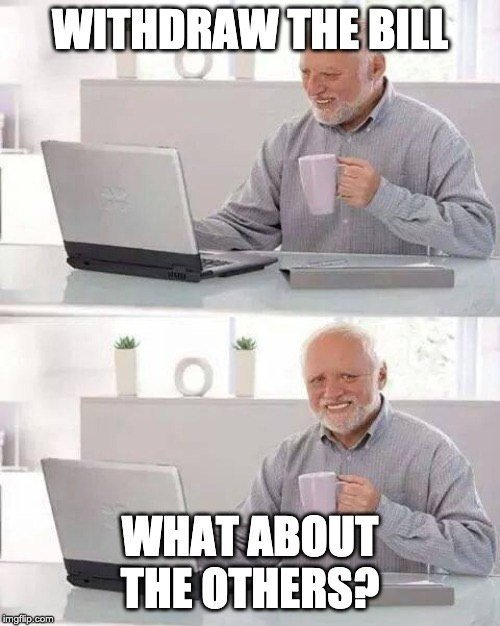

These all insist on the government to not BS around, and satisfy the FIVE demands, and not just one... These are like, classic, vintage memes right here.

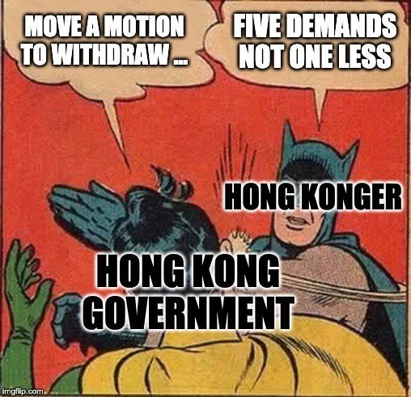
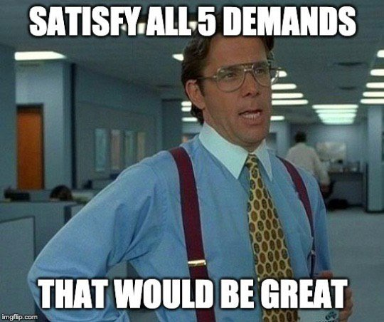
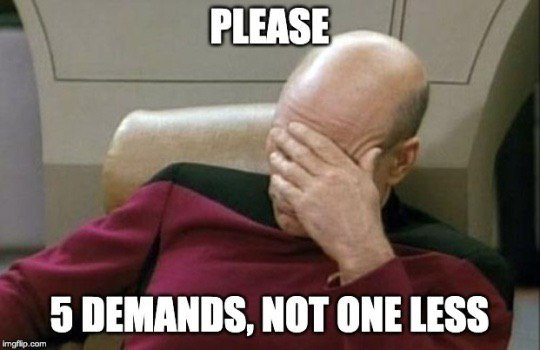

More on the 'FIVE DEMANDS! NOT ONE LESS!' theme. Again, classics here.

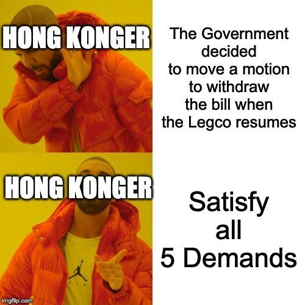
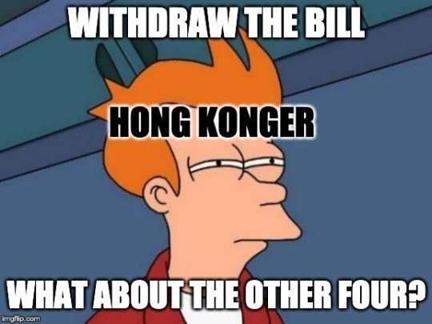
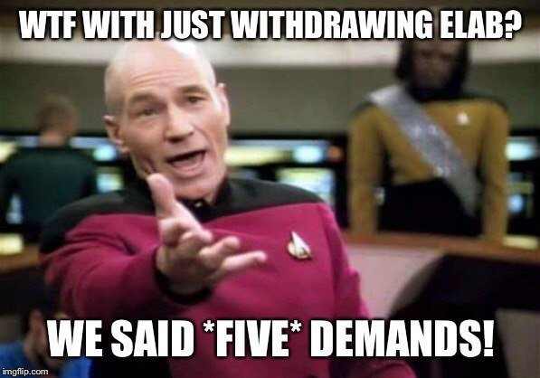

And this last batch all insist on how Lam is just... not credible or trustworthy. This was a month and a half ago! Yeah, things have not improved...

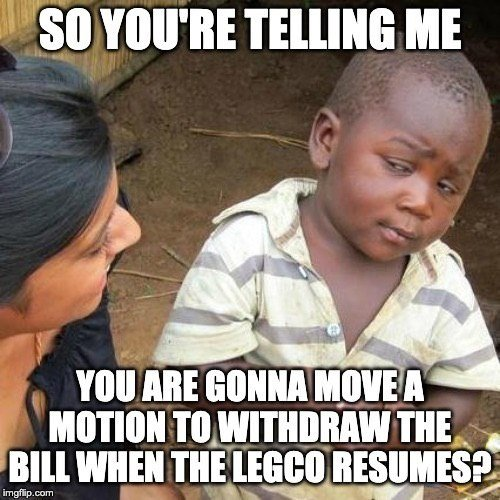
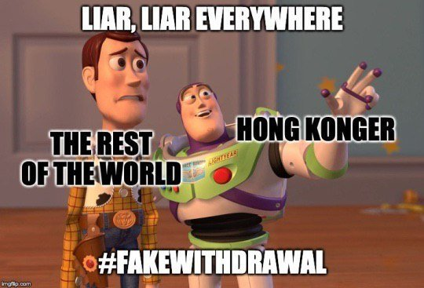
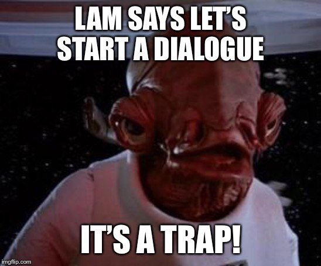
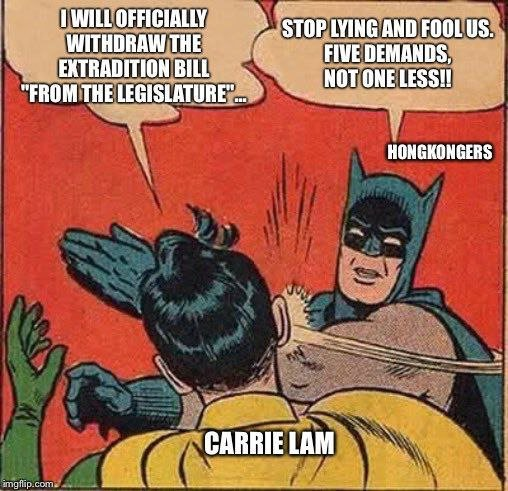