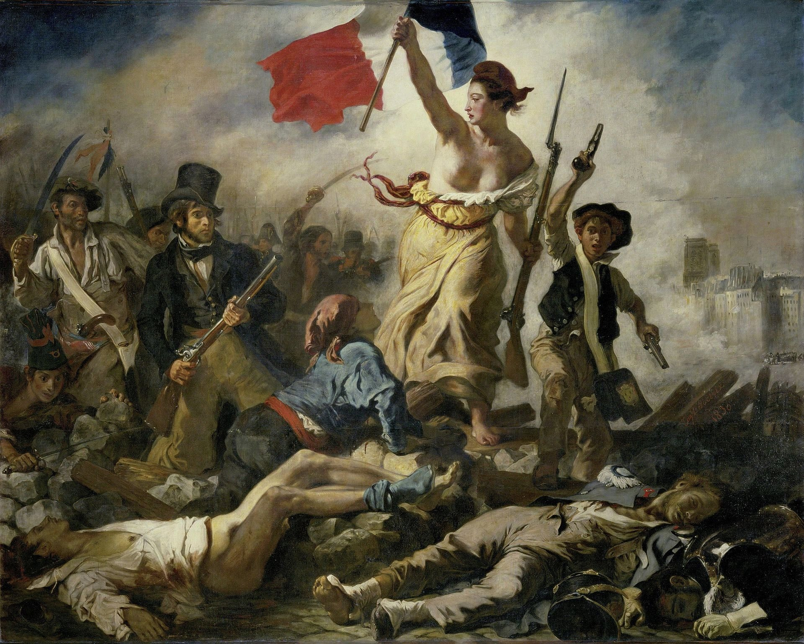
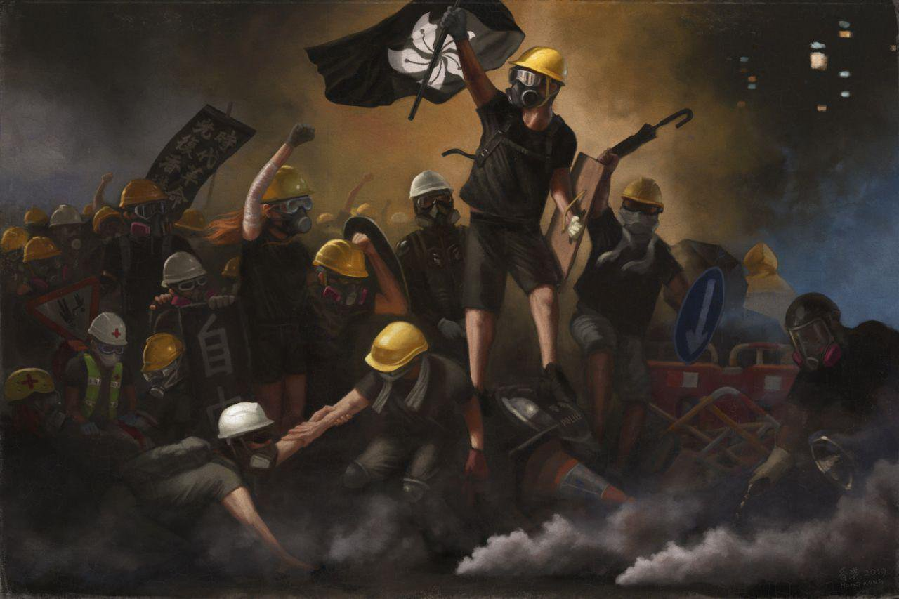

# Delacroix and Hong Kong
*Sep 23, 2019*

I ❤️this. The various HK versions of 'La Liberté guidant le peuple' from the movement are stunning. All a tad different in tone and feel, but all build towards some unifying mythology.

Below: Delacroix's original

https://twitter.com/yuen_cecil/status/1176313264025718787

These started popping up mid-Aug. By then HKers have a budding awareness that it's more than a protest, hence the revolutionary imagery. Note how all the pistols etc of the original are replaced in this one by everyday objects - umbrellas, laser pens, loudspeaker, and the press!

This one went for the original HK flag instead of the black bauhinia, which is different. This version has the HK mom who pleaded with the police from early on in the mvmt in the background, and non-geared up folks, highlighting unity of HKers.

This latest one is a veritable bingo card of all the HK protest iconography - hardhat, black bauhinia, mask, 時代革命, teargas... But note the shields, lack of weapons and the lighting - HKers see themselves as defenders of their city through the dark night, waiting for the dawn.

