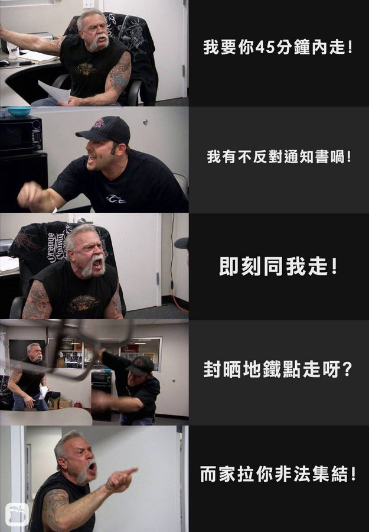
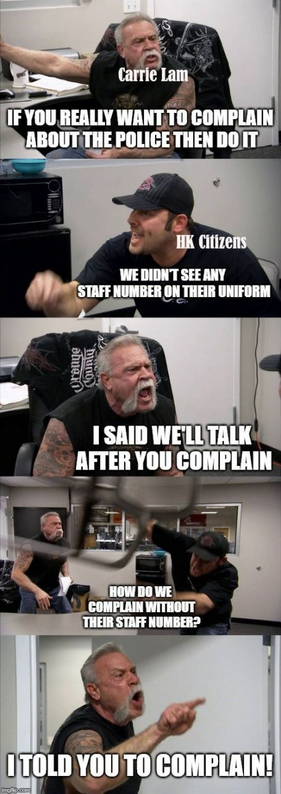
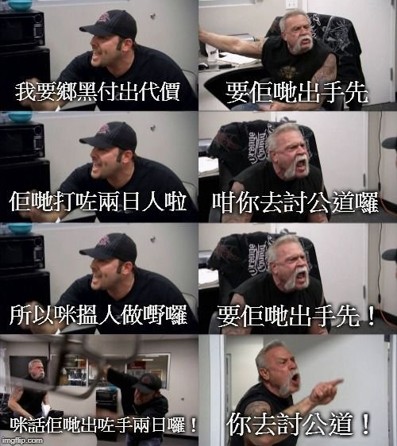
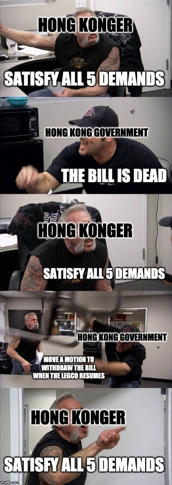
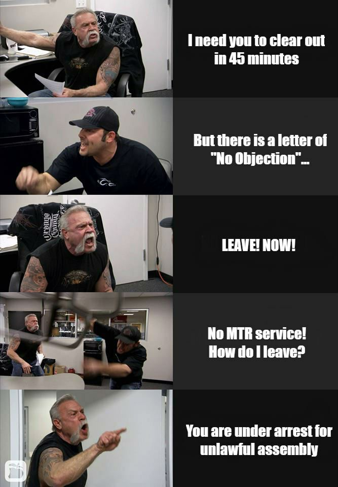
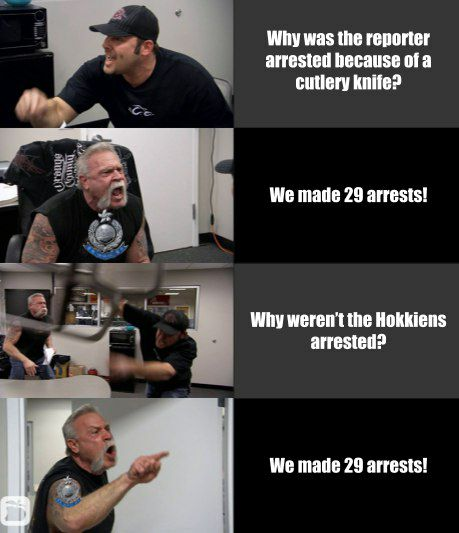
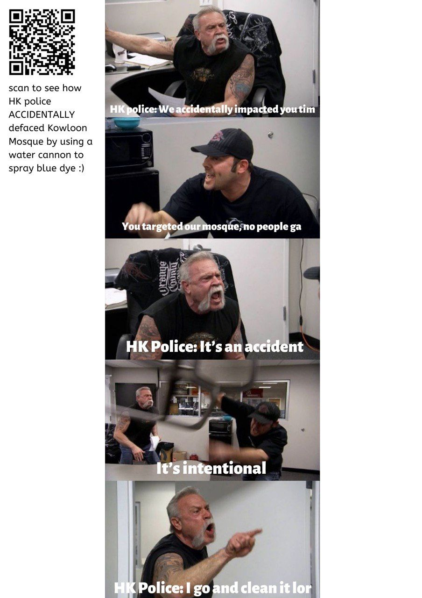
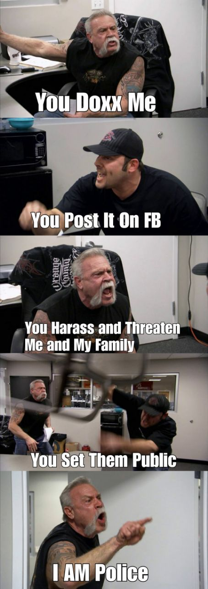
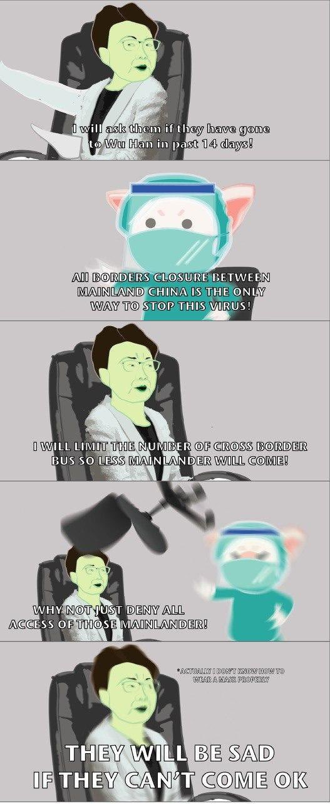

#American Chopper Meme
*Nov 13 2019*

Angry men shouting, neither getting their pt across, & then someone throws a chair - captures the mvmt perfectly.  We look at the times the meme has appeared to see all the things that hv made us mad since June. 

This appeared mid-June, when HKers noticed HKPF not wearing IDs. If they don't have IDs, you can't complain about their actions. And you can't complain about the lack of cop ID, bcos... no cop ID. Yes, it is as Kafkaeque as it sounds, & why Jnr throws a damn chair.

This was from late July, after triad members attacked HKers in Yuen Long as the police looked the other way. 
Jnr: they've been beating up ppl! 
Snr: Wait until they act, then we can do sth. 
Jnr: FFS! They've already assaulted ppl!.. 

Jnr throws a damn chair.

Sep 4 - Lam announces withdrawal of ELAB. HKers were not satisfied - we've been chanting for '5 Demands' for weeks by that point. So here, Snr and Jnr have a shouting match - Snr wants all the 5 Demands satisfied, the gov't, Jnr,  just ain't having it, & throws a damn chair.

This one refers to HKPF stopping the approved peaceful march on 8 Sep after just 45 minutes. But the govt also closed down metro stations, so there was no way to disperse. Which gave popo an excuse to arrest folks...bcos they can't leave the area. Jnr throws a damn chair.

Continuing on theme of the HKPF being a pathetic, cruel mess, this one from mid Sep highlights the police's selective enforcement of the law. Student journos w/ a small knife for mooncakes?- Arrest! Gangs wielding actual cleavers? - Very fine folks. Jnr throws a damn chair.

Oct, after HKPF 'smurfed' the Kowloon mosque w/ their water cannon "by accident". There's video proof there were no protestors around & the cannon taking direct aim, so-what an accident! Hard to argue w/ ppl who insist reality is not what it is, & why Jnr throws a damn chair.

This is from late Oct, on back of the 'anti-doxxing' injunction that prohibits HKPF's info from being publicised. It's so wide-ranging that it includes... reporters showing HKPF's faces? It made no sense, just another way for HKPF to repress. 
And why Jnr throws a damn chair.

##Update, Jan 29 2020

We now have this version of the American Chopper meme with Lam and LinPig arguing about the merits of closing the border because of #coronaravirus. As you would expect, a chair gets thrown.

